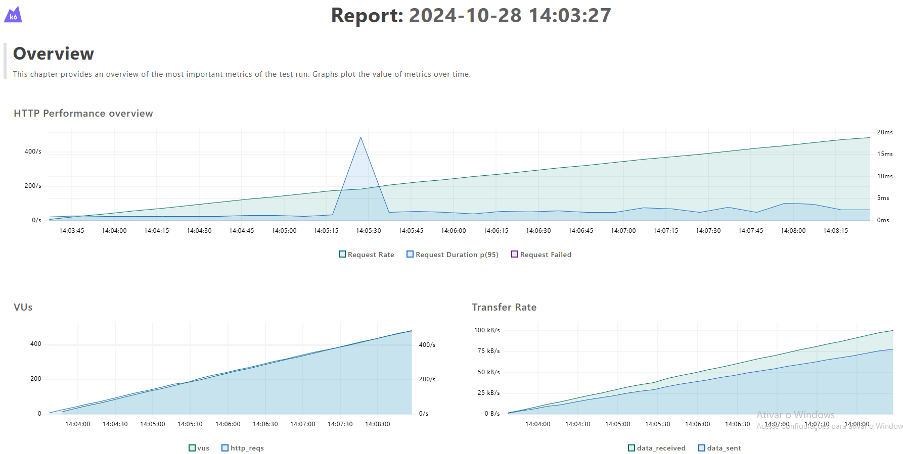
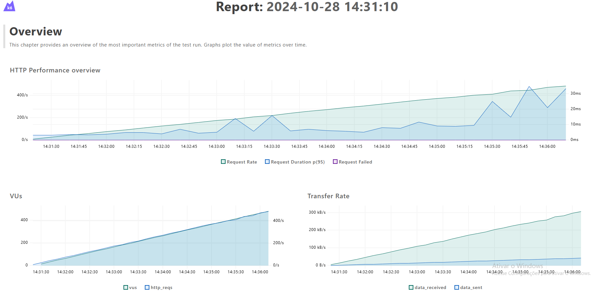

# Projeto performance


## Descrição
O objetivo deste projeto é demonstrar dominio em testes de performance. Utilizando uma API Mock, facilitando a execução local do projeto. 

## Ferramentas Utilizadas
- **Framework**:  
- **Ferramenta**: 
- **Versão Node.js**: 
- **Linguagem do Projeto**: 

## Pré-requisitos do projeto
- **Java**:  

## Como iniciar a API Mock do projeto
Para iniciar a API Mock, execute o seguinte comando no PowerShell:

```powershell
java -jar wiremock-standalone-3.9.1.jar
```

## Como executar os cenários de performance

```powershell
K6_WEB_DASHBOARD=true K6_WEB_DASHBOARD_EXPORT=results/html-report-validar-inclusao.html k6 run tests/validarInclusao.js
```


```powershell
K6_WEB_DASHBOARD=true K6_WEB_DASHBOARD_EXPORT=reslts/html-report-validar-busca.html k6 run tests/validarBusca.js
``` 
